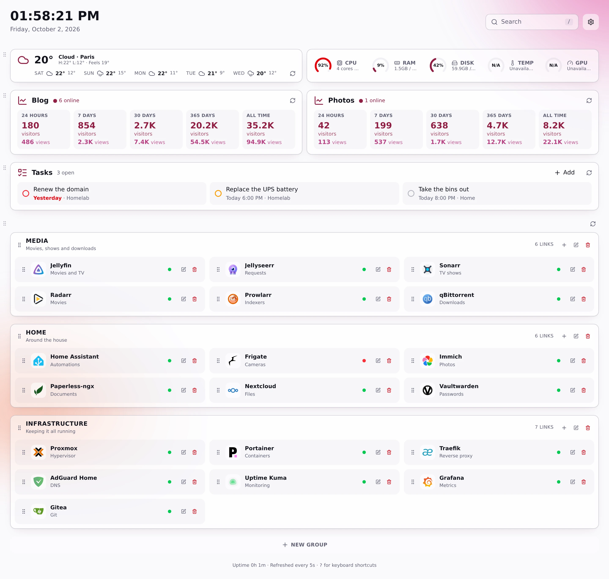
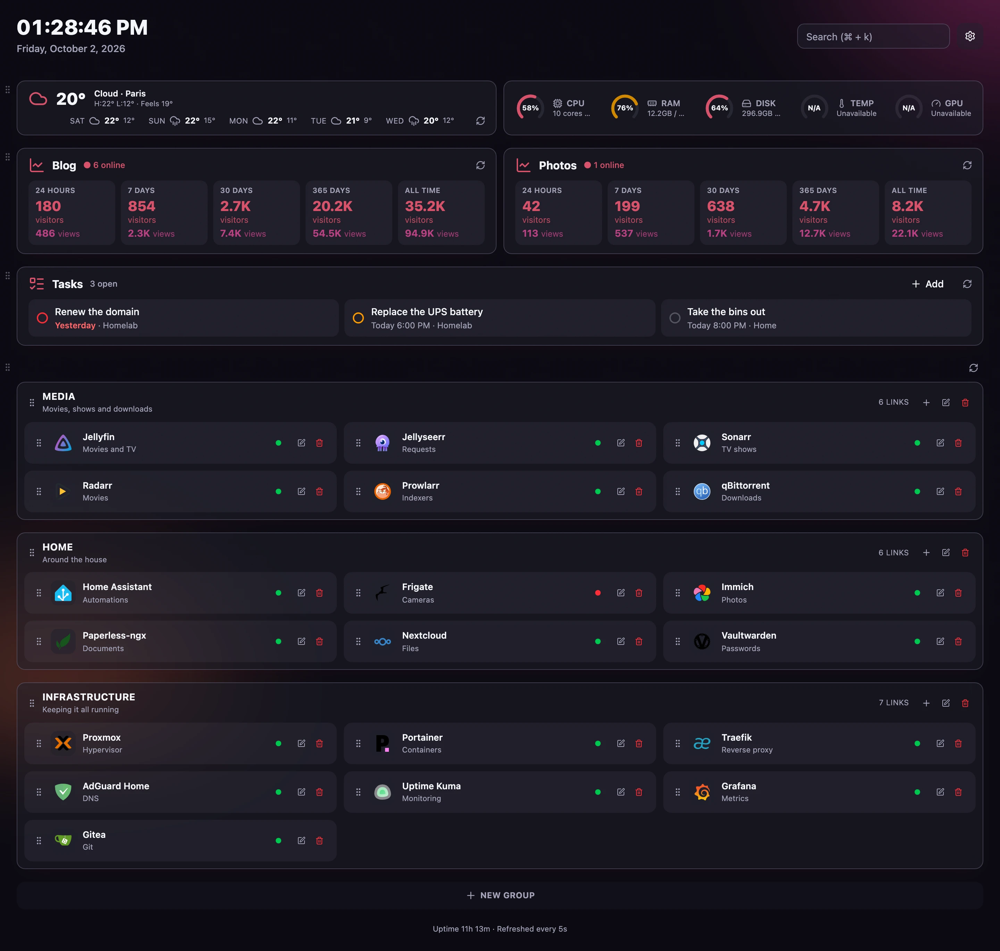
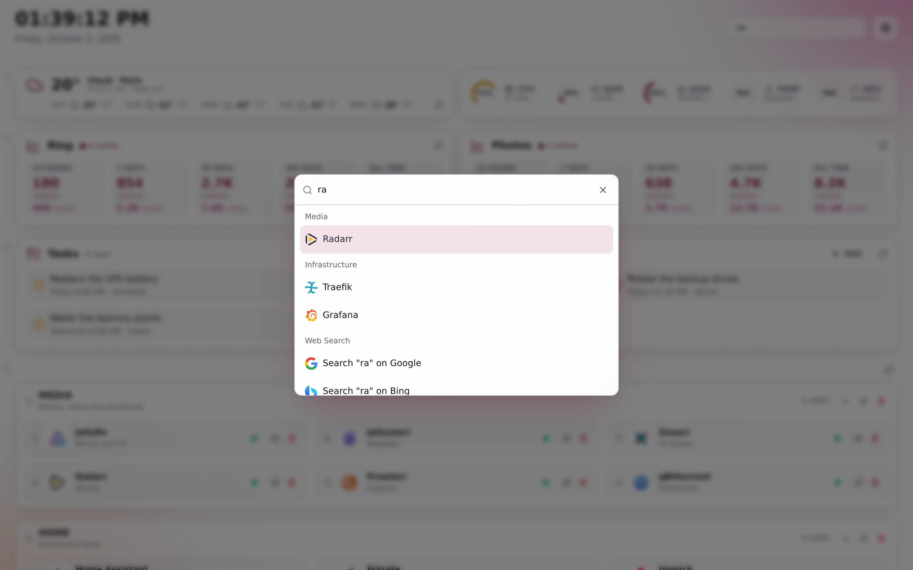
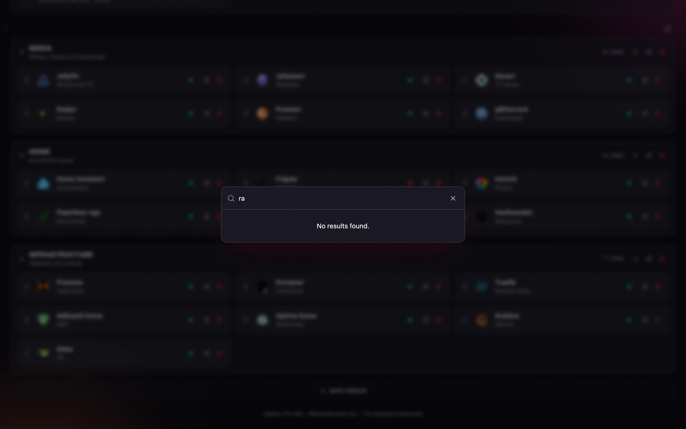
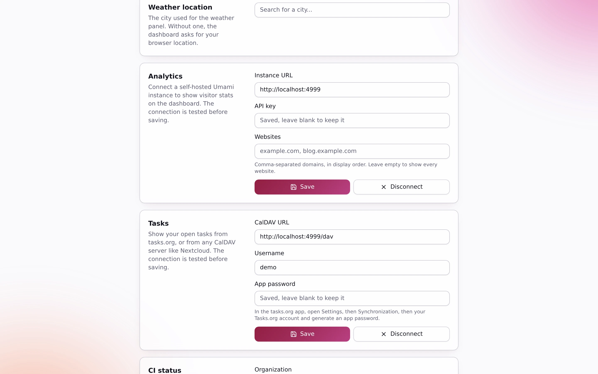
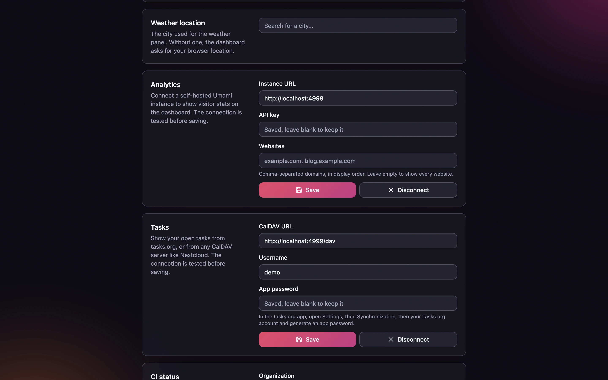
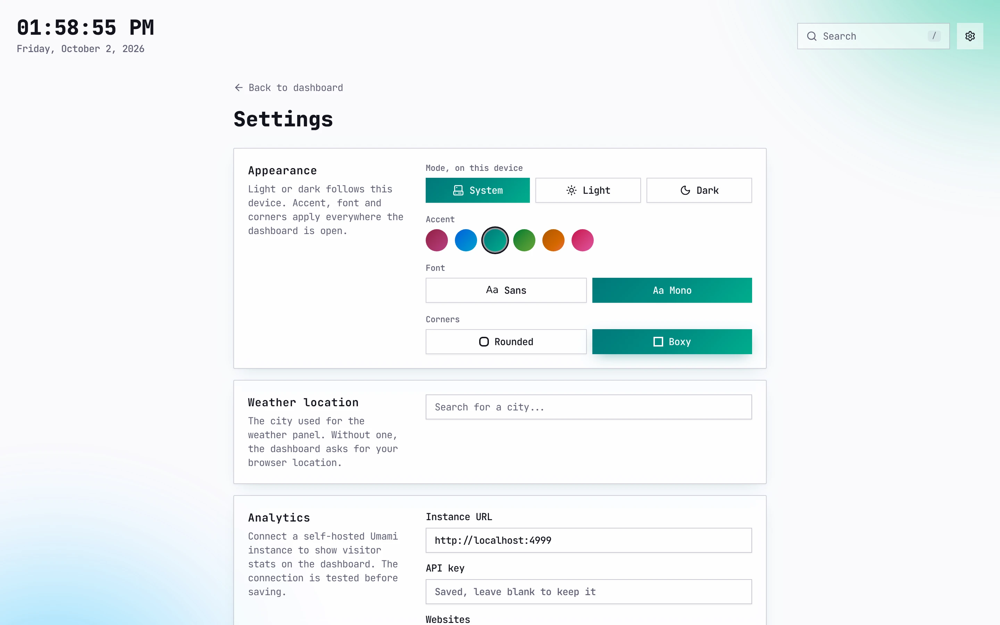
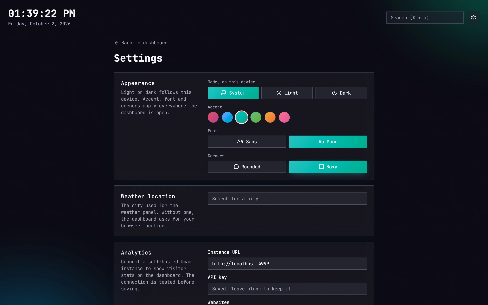
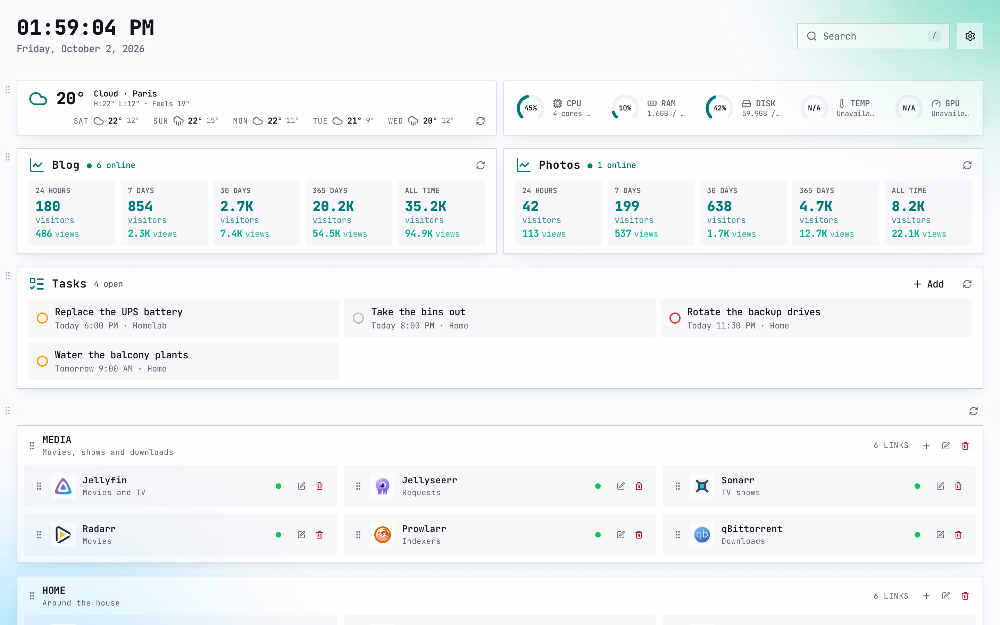
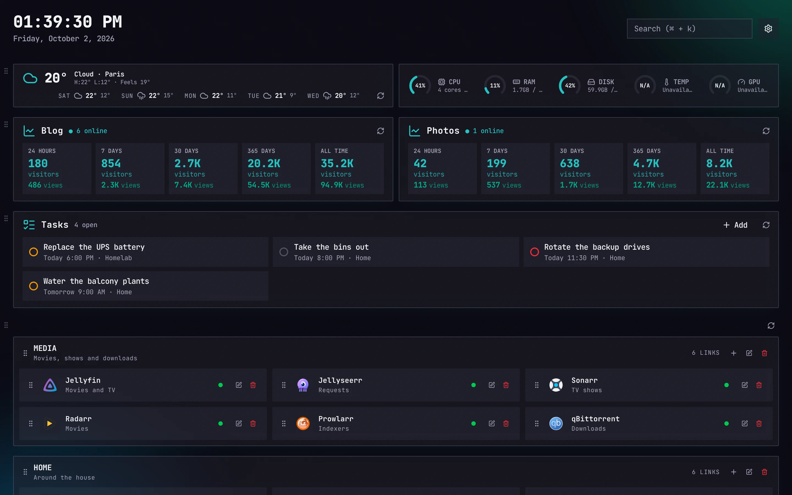

# Features

 

- **Links in groups.** Each link has a title, description, URL, target (same or new tab) and an
  icon, either an image URL or a name from [Dashboard Icons](https://dashboardicons.com/icons).
  Drag a link by its grip to reorder it or move it to another group.
- **Online status.** The server sends a `HEAD` request to every link (5 second timeout, cached
  for 30 seconds). Any response below 500 counts as online. Self-signed certificates are accepted.
- **Weather.** Current conditions and a 5-day forecast from
  [Open-Meteo](https://open-meteo.com/), no API key needed.
- **Analytics.** Live visitors, plus visitors and pageviews over 24 hours, 7, 30 and 365 days and
  all time per website from a self-hosted [Umami](https://umami.is/) v3 instance. Connect it in
  Settings with the instance URL and an API key.
- **Tasks.** Your open tasks from [tasks.org](https://tasks.org/) or any CalDAV server (Nextcloud,
  Radicale, ...), soonest due first, with overdue ones in red. Connect it in Settings with the
  CalDAV URL, your username and an app password. Read-only.
- **CI status.** The latest GitHub Actions run of each workflow on the default branch, per
  repository. In Settings, register a read-only GitHub App in one click (optionally under an
  organization), then install it on the repositories to watch. Cached for a minute.
- **System stats.** CPU, RAM, disk, temperature and GPU gauges for the host the app runs on.
- **Search.** `Cmd+K` / `Ctrl+K` opens a palette to jump to any link or search the web.
- **Backup and restore.** Export your groups and links to JSON from Settings, and import them back.
- **Appearance.** Light, dark or system per device, and for every device a Bordeaux, blue, teal,
  green, amber or rose accent, a sans or monospace font, and rounded or boxy corners.

The page refreshes its stats every 5 seconds. Drag a section by the grip in its left margin to
reorder the dashboard; the order is saved on the server.

 

 

 

The same dashboard in teal, monospace and boxy:

 
